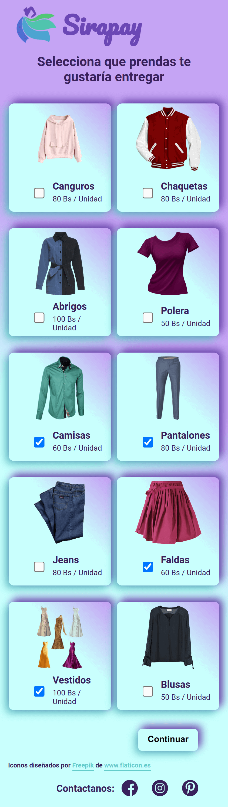
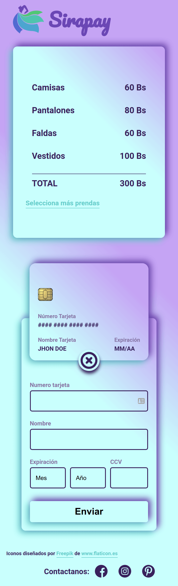

# Sirapay Tarjeta de Crédito

Esta aplicación web permite seleccionar prendas de ropa que se entregaran a la empresa Sirapay para ser refaccionada. Luego envía al usuario a una sección de cobro en la que el usuario puede registrar su tarjeta de crédito o débito. La web no guarda los datos de la tarjeta de crédito y tampoco realiza cobros monetarios a los usuarios.

Para ver la página web haz [click aqui](https://rodruxdev.github.io/sirapay-credit-card/)

## Indice

- [UX](#ux)
- [Tecnologías](#tecnologías)
- [Instalación](#instalación)
- [Licencia](#licencia)
- [Autor](#autor)

## UX

### Usuario y objetivo

Los usuarios son clientes de la empresa Sirapay. La empresa se encarga de refaccionar o rediseñar ropa usada. El usuario de la aplicación web selecciona que tipo de prendas mandará a la empresa y a continuación realiza el registro de su tarjeta de crédito o débito para realizar el pago.
Sin embargo, la aplicación web no guarda información de la tarjeta y tampoco realiza cobros reales.

### Solución para el usuario

Permite realizar la selección de las prendas o ropa que mandará a la empresa y realizar el "pago" a la empresa. De esta forma la empresa tiene registro del servicio que va a realizar para el usuario.
Sin embargo, la aplicación web aún no tiene registro de datos ni conexión con una base de datos, solo permite la interacción con la página y observar una propuesta de diseño para la página web final de la empresa.

### Ideas Iniciales del Diseño

El diseño para mobile presentaría una columna para mostrar las prendas que puede entregar y la misma columna se mantendría para mostrar el costo del servicio y el registro de la tarjeta de crédito.
Para pantallas de pc extiende las columnas de mobile a tres columnas diferentes. Mientras que la sección de servicio y registro de la tarjeta de crédito se separa en dos columnas.
Para el diseño se utilizo la tendencia de diseño llamada neomorfismo.
El diseño de la sección de la tarjeta de crédito fue realizado mediante el tutorial de [Carlos Arturo - FalconMasters](https://github.com/falconmasters) mediante el siguiente [video](https://www.youtube.com/watch?v=7bciaLTTr7s)

### Previsualizacion de Pantalla Mobile

Pantalla 1

Pantalla 2

### Previsualizacion de Pantalla de Escritorio

Pantalla 1

Pantalla 2

## Tecnologías

Para el proyecto se utilizó las siguientes tecnologías:

* HTML 5
* CSS 3
* JavaScript

## Instalación

1. Clona o descarga el repositorio en tu equipo.
2. Ingresa al directiorio del repositorio por terminal.
3. Instala las dependencias del proyecto utilizando NodeJS con el comando `npm install`.
4. Inicia un servidor local del proyecto con el comando `npm start`.
5. Ingresa en tu navegador a la dirección `http://localhost:5000`.

Este proyecto es parte de la ruta del bootcamp de [Laboratoria - Frontend Developer](https://www.laboratoria.la/) del año 2020. Estoy realizando sus proyectos de forma autodidacta e independiente.

## Licencia

> Este proyecto esta bajo la licencia MIT.

## Autor

Hecho con 💚 por [rodruxdev](https://twitter.com/rodruxdev)

  <h3>
    <a href="https://rodrigojgq.github.io/sirapay-credit-card/">
      Página Web
    </a>
     | 
    <a href="https://github.com/Laboratoria/BOG002-card-validation">
      Instrucciones
    </a>
  </h3>

